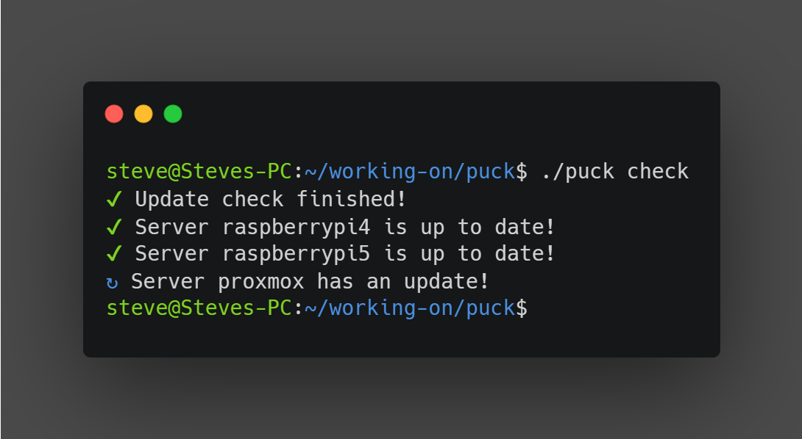

## Puck 🏒

Puck (Package Update Checking Kit _yes I know it sucks_) is a simple tool that connects to your servers and checks for
apt package updates.



> Warning ⚠️: Puck is in early stages of development it still has a lot of missing features I want to add. I hope I can have a stable release soon.

### Features 😲

Well about that...

- Tiny CLI (only 10mb)
- Beatiful CLI (I guess)
- Really fast\*

> Puck itself is really fast since it's written in GO but the actual speed depends on the server

### Todo 📃

- [ ] Redesign the CLI UI
- [ ] Docker Image
- [ ] Web UI
- [ ] Notifications (via ntfy/discord)
- [ ] Ability to not use sudo (for systems running with root)
- [ ] Update systems?
- [ ] Support for other package managers

### Running 🏃

The only way to run puck for now is by building it from source (I am currently working on the github actions workflow) this can be done very easily by installing go then running:

```bash
go build .
```

The build is really fast and when it finished you should have a binary called `puck` in your current directory.

### Usage

Puck is really simple to use, it works using a simple yaml configuration file. Here is an example:

```yaml
servers:
  - name: myserver
    hostname: 192.168.1.5
    username: someone
    password: hello!

  - name: server2
    hostname: server2.local
    username: me
    password: reallysecurepassword
    privateKey: /some/path/id_rsa
```

> Note 📝: The password field is used for gaining root privileges with sudo so the apt commands can be run. If you use a raspberry pi which allows the usage of sudo without password authentication you can skip the password field and only ssh with the private key

### Requirements on servers

Right now puck has a 2 requirements on the server side so it can check for updates. Firstly it need the server to run a debian based disto which uses apt and it also needs sudo to be installed. Both of these requirements will become obsolete in the future.

### Contributing ❤️

Contributing is really easy in puck you simply need to have go and git in your system, then you can clone the repository make your changes and open a pull request. Any help is appreciated.

### License 📜

The project is licensed under the GPL V3 License. You may modify, distribute and copy the code as long as you keep the changes in the source files. Any modifications you make using a compiler must be also licensed under the GPL license and include build and install instructions.

### Acknowledgments 🙏

- The project is heavily inspired from [cup](https://github.com/sergi0g/cup).
- [Carbon](https://carbon.now.sh/) thanks for the screenshot
